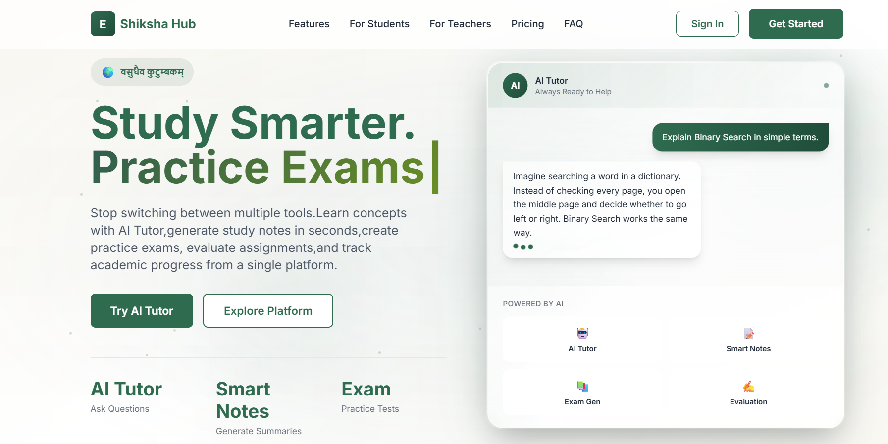
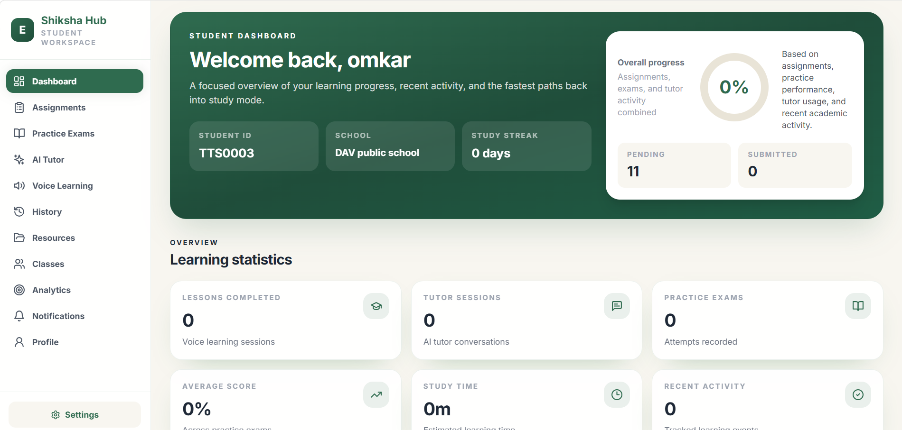
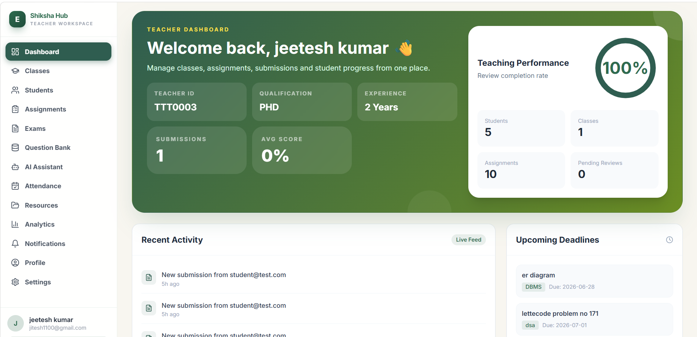
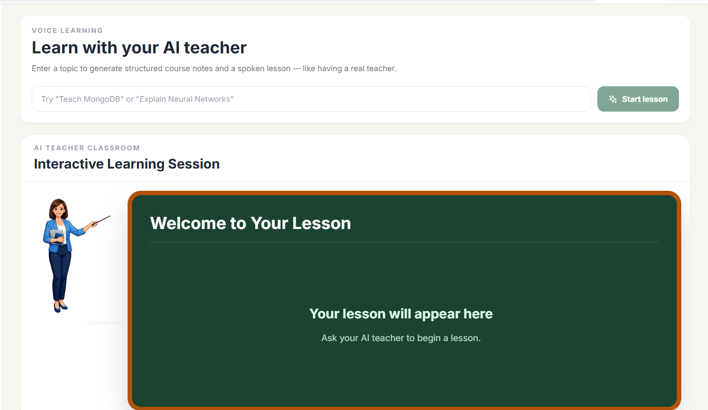
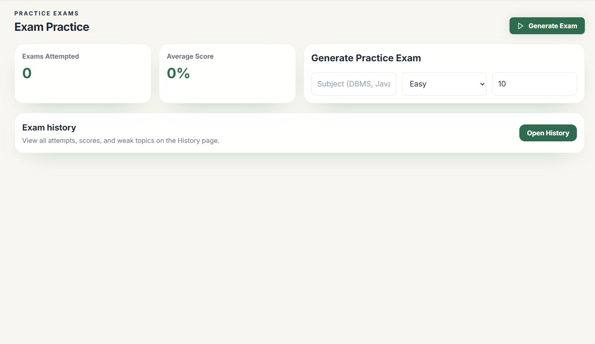
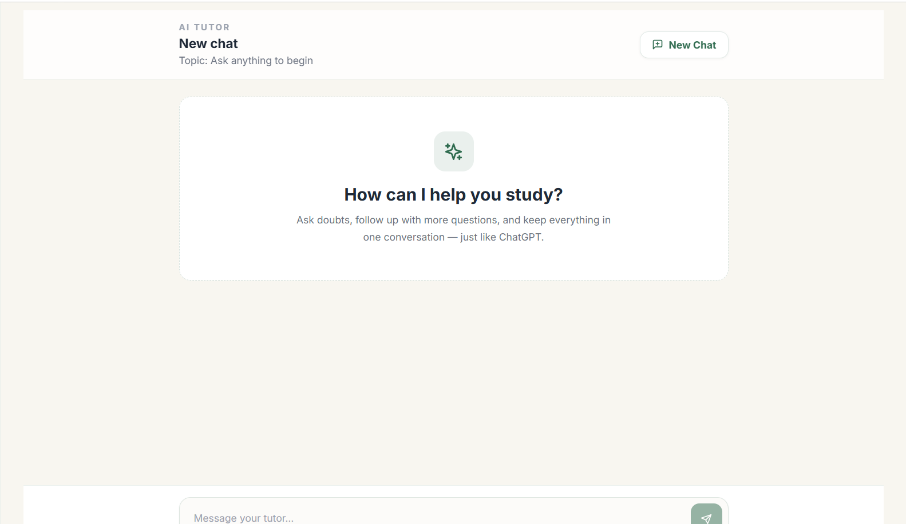
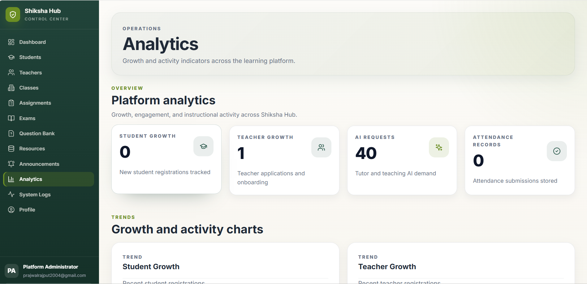
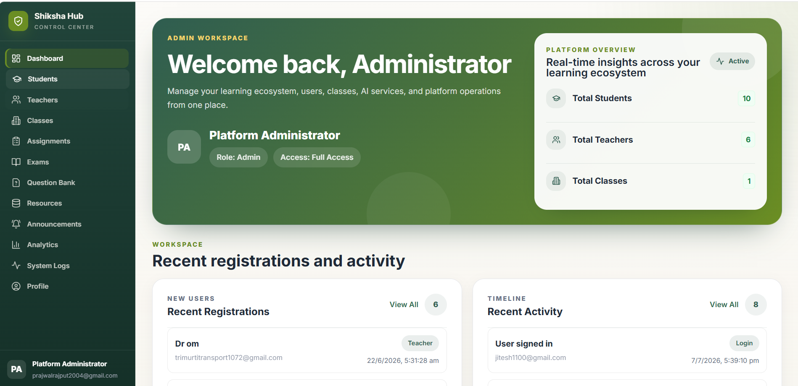
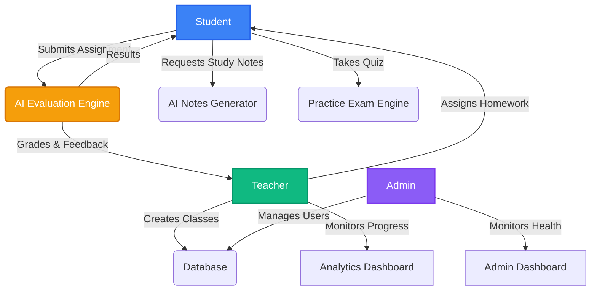

<div align="center">
  
  
  # Shiksha Hub

  *An AI-powered Learning Management Platform connecting Students, Teachers, and Administrators through intelligent learning tools.*

  [](#)
  [](#)
  [](#)
  [](#)
  [](#)
  [](#)
</div>

<br />

## 📖 Overview

**Shiksha Hub** is a world-class, AI-powered Learning Management Platform built to revolutionize the educational experience. It seamlessly connects **Students**, **Teachers**, and **Administrators** by leveraging advanced Large Language Models (LLMs). Rather than traditional manual grading and note-taking, Shiksha Hub empowers users to automatically generate comprehensive study notes, evaluate complex assignments, conduct voice-assisted learning, and track performance analytics in real time. 

---

## ✨ Features

### 🎓 Student Features
- **Student Dashboard:** Real-time overview of assignments, exams, and AI tool usage.
- **Assignment Submission:** Submit files (PDF, DOCX, TXT) for instant AI evaluation.
- **Progress Tracking:** Monitor personal analytics and activity history.
- **Leaderboard:** Gamified ranking system based on assignment scores and platform engagement.

### 👨‍🏫 Teacher Features
- **Teacher Dashboard:** Comprehensive view of classes, students, and resources.
- **Class & Student Management:** Organize students into class groups and track attendance.
- **Assignment Creation:** Distribute assignments directly to students with automated AI grading.
- **Announcements & Resources:** Broadcast messages and share study materials.

### 🛡️ Admin Features
- **Admin Dashboard:** High-level platform statistics (total users, exams, submissions, feature usage).
- **User Management:** Oversee all platform activity and manage student/teacher accounts.
- **System Analytics:** Track success rates and AI integration health.

### 🤖 AI Features
- **AI Tutor:** Context-aware academic assistant available 24/7 for student queries.
- **Practice Exams Generator:** Generate customized question papers automatically based on topics.
- **Notes Generator:** Convert topics or documents into highly structured study materials.
- **Assignment Evaluation:** Automated grading that highlights marks, strengths, weaknesses, and actionable feedback.
- **Voice Learning:** Convert AI-generated text into lifelike speech for auditory learning.

### 🔐 Authentication & Role Based Access
- **JWT Authentication:** Secure token-based API access.
- **Role Based Access Control (RBAC):** Strict isolation between Student, Teacher, and Admin routes.

### 📊 Analytics & History
- **Analytics:** Visual charts tracking engagement, performance, and submissions.
- **History Module:** Persistent tracking of all AI interactions (Notes, Exams, Tutor Chats).

---

## 📸 Screenshots

| Landing Page | Student Dashboard |
| :---: | :---: |
|  |  |

| Teacher Dashboard | AI Tutor |
| :---: | :---: |
|  |  |

| Practice Exam | Voice Tutor |
| :---: | :---: |
|  |  |

| Analytics | Admin Panel |
| :---: | :---: |
|  |  |

---

## 🏗️ Architecture Overview

```text
       Frontend (React + Vite)
                  │
                  ▼
        Backend (FastAPI)
                  │
   ┌──────────────┼──────────────┐
   ▼              ▼              ▼
MongoDB       LLM APIs     File Processing
```

---

## 🛠️ Technology Stack

### Frontend
- **Framework:** React 18
- **Build Tool:** Vite
- **Styling:** Tailwind CSS
- **Animations:** Framer Motion, Three.js (@react-three/fiber)
- **Routing:** React Router DOM
- **Icons:** Lucide React

### Backend
- **Framework:** FastAPI (Python 3.10+)
- **Server:** Uvicorn
- **Document Processing:** PyPDF2, python-docx
- **Text-to-Speech:** gTTS (Google Text-to-Speech)

### Database
- **Primary Database:** MongoDB
- **Driver:** Motor (Async Python driver)

### Authentication
- **System:** JSON Web Tokens (JWT)
- **Hashing:** Passlib (Bcrypt)

### AI
- **LLM Engine:** OpenRouter API, Gemini API

---

## 📂 Folder Structure

```text
Shiksha-Hub/
├── assets/                 # Project assets (e.g., logo)
├── backend/
│   ├── app/
│   │   ├── api/            # Route controllers (auth, student, teacher, ai)
│   │   ├── core/           # Core configuration settings
│   │   ├── database/       # MongoDB connection & setup
│   │   ├── dependencies/   # FastAPI auth & role dependencies
│   │   ├── models/         # Pydantic data models
│   │   ├── schemas/        # Request & Response schemas
│   │   ├── services/       # Business logic (AI processing, file parsing)
│   │   └── utils/          # Helper utilities
│   ├── main.py             # FastAPI entry point
│   ├── requirements.txt    # Python dependencies
│   └── .env                # Backend environment variables
├── frontend/
│   ├── src/
│   │   ├── components/     # Reusable UI components
│   │   ├── contexts/       # React Context (Auth, Theme)
│   │   ├── hooks/          # Custom React hooks
│   │   ├── pages/          # Application pages (Dashboards, Auth)
│   │   ├── services/       # Axios API clients
│   │   └── utils/          # Frontend helpers
│   ├── index.html
│   ├── package.json
│   ├── tailwind.config.js
│   └── vite.config.js
├── screenshots/            # UI screenshots for documentation
└── README.md
```

---

## 🚀 Installation

### 1. Backend Setup

```bash
cd backend
python -m venv venv

# Windows
venv\Scripts\activate
# Linux/Mac
source venv/bin/activate

pip install -r requirements.txt
```

### 2. Frontend Setup

```bash
cd frontend
npm install
```

### 3. Environment Variables

Create a `.env` file in the `backend/` folder:
```env
MONGODB_URL=your_mongodb_connection_string
DATABASE_NAME=shiksha_hub
JWT_SECRET=your_secret_key
OPENROUTER_API_KEY=your_api_key
GEMINI_API_KEY=your_api_key
ADMIN_EMAIL=your_admin_email
ADMIN_PASSWORD=your_admin_password
MAIL_USERNAME=your_email@gmail.com
MAIL_PASSWORD=your_app_password
MAIL_FROM=your_email@gmail.com
MAIL_PORT=587
MAIL_SERVER=smtp.gmail.com
```

Create a `.env` file in the `frontend/` folder:
```env
VITE_API_URL=http://localhost:8000
```

### 4. Running Locally

**Start the Backend API:**
```bash
cd backend
uvicorn main:app --reload --host 0.0.0.0 --port 8000
```

**Start the Frontend Client:**
```bash
cd frontend
npm run dev
```

Navigate to `http://localhost:5173` to access the Shiksha Hub interface.  
API documentation is available at `http://localhost:8000/docs`.

---

## 🔑 Demo Access

### Student
Register directly from the application landing page.

### Teacher
Create a teacher account and wait for admin approval before accessing the dashboard.

### Admin
Admin credentials are securely managed through backend environment variables and provisioned on deployment.

---

## 📚 API Documentation

FastAPI provides interactive documentation out of the box. Below are key modular endpoints:

### Authentication
- `POST /auth/register` - Register a new user
- `POST /auth/login` - Authenticate user and receive JWT

### Student
- `GET /student/dashboard` - Retrieve student analytics and pending tasks
- `GET /student/exams` - List available practice exams for the student

### Teacher
- `GET /teacher/classes` - View all assigned classes
- `POST /teacher/assignments` - Create a new assignment for a class
- `GET /teacher/students` - Monitor student progress and attendance

### Admin
- `GET /admin/dashboard` - Get high-level system metrics
- `GET /api/public/stats` - Fetch public platform statistics

### AI Services
- `POST /ai/tutor` - Chat with the AI tutor for academic help
- `POST /ai/notes` - Generate study notes based on topic or uploaded file
- `POST /ai/exam` - Generate a practice exam using AI
- `POST /ai/assignment-check` - Evaluate a submitted assignment

### Assignments & Submissions
- `POST /assignment-upload/` - Upload assignment files for processing
- `GET /submissions/` - Fetch submission history

### History & Profile
- `GET /history/` - View past AI interactions
- `GET /profile/me` - Get current user profile details
- `PUT /profile/update` - Update user information

---

## 🔄 Platform Workflow



---

## 🛡️ Security

Shiksha Hub utilizes industry-standard security measures to protect user data and platform integrity:

- **JWT (JSON Web Tokens):** All private API routes require a valid bearer token generated upon successful login.
- **Role-Based Authentication:** Dedicated middleware ensuring Students cannot access Teacher routes, and Admin routes remain strictly isolated.
- **Password Hashing:** Passlib and Bcrypt are used to securely salt and hash passwords before saving them to MongoDB.
- **Protected APIs:** FastAPI Dependency Injection (`Depends`) validates user sessions on every secure request.
- **Environment Variables:** Credentials, API keys, and database URIs are loaded exclusively via `.env` files and never committed to source control.

---

## 📦 Current Modules

✅ **Student Dashboard**  
✅ **Teacher Dashboard**  
✅ **Admin Dashboard**  
✅ **AI Tutor**  
✅ **Voice Tutor** (Text-to-Speech Integration)  
✅ **Practice Exam**  
✅ **Notes Generator**  
✅ **Assignment Evaluation**  
✅ **Analytics**  
✅ **History**  

---

## 🚀 Future Roadmap

While Shiksha Hub is feature-rich, we are continuously expanding. 

- [ ] 🚧 **AI Avatar Teacher** (Under Development)
- [ ] 🚧 **Live Classes / WebSockets** (Under Development)
- [ ] **Speech-to-Speech Interactions**
- [ ] **RAG (Retrieval-Augmented Generation)** for highly contextual course knowledge
- [ ] **Adaptive Learning** paths based on student weakness mapping
- [ ] **Mobile App** (React Native)

---

## 🤝 Contributing

We welcome contributions from the open-source community! To contribute:

1. **Fork** the repository.
2. **Create a Branch:** `git checkout -b feature/AmazingFeature`
3. **Commit your changes:** `git commit -m "Add AmazingFeature"`
4. **Push to the branch:** `git push origin feature/AmazingFeature`
5. **Open a Pull Request.**

Please ensure your code follows the established formatting and includes relevant tests for backend changes.

---

## 📝 License

This project is licensed under the **MIT License**. See the `LICENSE` file for details.

---

## 👨‍💻 Author

**Saurabh Kumar**
- 🐙 GitHub: [https://github.com/mrsingh1072](https://github.com/mrsingh1072)
- 💼 LinkedIn: [https://www.linkedin.com/in/saurabh-singh-959b48323/](https://www.linkedin.com/in/saurabh-singh-959b48323/)

---

## 📞 Support

If you encounter any issues or have questions, please [open an issue](https://github.com/mrsingh1072/Shiksha-Hub/issues) on GitHub.

⭐ **If you find Shiksha Hub helpful, please consider giving this repository a star!** ⭐

---

Made with ❤️ and lots of ☕

---
